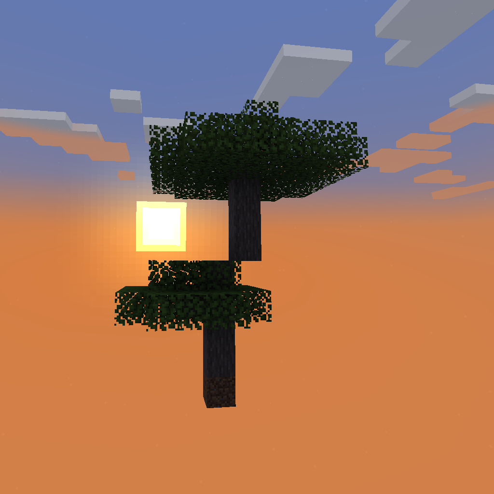

# Skylark
Generation and utility mod for Fabric sky block games.

You do not need to ask me in order to use this mod in a modpack or to use
this code in your own mod.  However, I would love to hear about it so I can
check it out.

## What does Skylark do today?
Currently implemented features:
* Disable all Overworld generation.
* Preserve the distribution of biomes.
* Generate one Mega Spruce at (0, 120, 0).
* Spawn the player on the spruce.

## What might Skylark do eventually?
Currently planned features:
* Allow generation of any starting feature (trees, etc.).
  * Randomized from a set?
* I think in 1.19 I can allow generation of structures too.
* Maybe add bonus things specific to finding different biomes?
* Option to distribute multiple players / teams:
  * A specific distance apart?
  * Tracking their spawn location individually.

I will generally add any features I find useful for sky block play but which
are not already available via other Fabric mods.  Suggestions are welcome.
